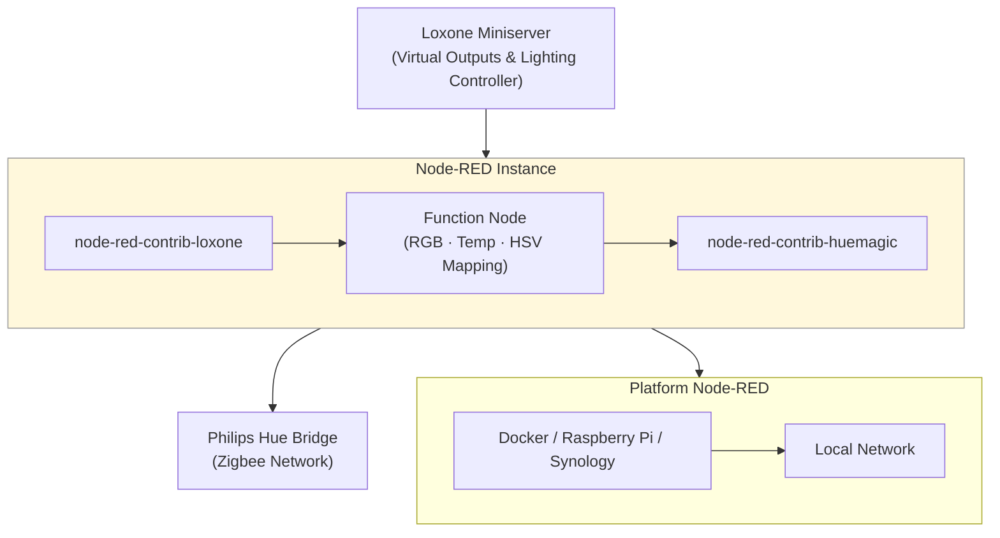

# Loxone → Node-RED → Philips Hue Bridge  
### A reliable and local integration between Loxone and Philips Hue using Node-RED

---

## 🔧 About this Project
Controlling **Philips Hue** lights directly from **Loxone** has always been tricky.  
This project bridges the two systems using **Node-RED** running on anything like a simple **Windows PC**, **Raspberry Pi** or in **Docker**,  
with a small **JavaScript mapping function** that normalizes events and payloads between Loxone and Hue.

Everything runs **locally** – no external cloud or remote services required.
It works with a standard Lighting Controller in Loxone and suports temp based colors, RGB colors and sequences.
<p align="center">
  
  
  
</p>

I tried everything to get it running without a service like Node-RED but did not get that working, the Pico-C code made my Loxone unstable (which is an achievement as such).So unfortunately with an extra component I got everything working pretty stable

Everything works, HSV (white temp), RGB and even sequences (party mode).

So apart from your Loxone and Hue devices you need Node-RED open source on something that runs already in your home (like my Synology) or if you really do not have anything buy a Raspberry Pi (I made it pretty by buying a EUR 15 DIN Housing and a EUR 8 LCD)


So without further ado
---
## Hardware
**Set 1**

Loxone miniserver (100335)

MacBook

Hue bridge v2

**Set 2**

Loxone miniserver (100335)

Raspberry Pi 3 4GB

Hue bridge v2


**Set 3**

Loxone miniserver (100335)

Synology DS918+ Docker(Container Manager)

Hue bridge v2

The sets react exactly the same

## Architecture




## How it Works

1. Loxone is programmed with a lighting controller which sends an RGB value to a Loxone Virtual Output 
2. Node-RED receives the payload through `node-red-contrib-loxone`.  
3. A Function node (JavaScript) maps the payload to Hue commands.  
4. The result is passed to `node-red-contrib-huemagic` → Hue Bridge.
   
## Setup / Installation
**Loxone**
Assuming a working Loxone Miniserver

Add a lighting controller

Add a Virtual Output "Hue", to get rid of any configuration incomplete message, put in the Hue Bridge IP address 


Add a Virtual output command to that Virtual Output, make sure "Use as Digital Output" is off as RGB is not just a true or false. No other config needed


Connect that Virtual output command to the controller


Submit to the Miniserver (save)
Then set the Light circuit (here LC1) to RGB


And make a nice mood just to test


That's it for Loxone

A switch like a T5 is useful but not really needed if you use the Loxone app

**Node-RED**

Get something that supports Node-RED, any PC, Mac, Linux, Docker, Azure, Amazon or Raspberry will work. I started by just installing it on my Mac to see if it worked.

Use the official Node-RED website http://nodered.org, they got a great "Getting Started" section.

After installation on any platform, you just type in the IP or hostname on port 1880. Eg. http://127.0.0.1:1880 if it runs on your computer.

Go to manage palette and install node-red-contrib-huemagic-fork and node-red-contrib-loxone (go to the tab install and type those names, no need for a separate download)


If you see the palette screen like this you are good!

**You are almost there**
**Now connect Hue to Node-RED**

Hue is straightforward, drag and drop the Hue bridge on your environment


Type in the IP address (or better, click find)
Then you need to enter your API key, click on the icon behind it and press the Hue button within a few seconds


Now add a Hue light 


Name it any useful name

Select your bridge

Click on the magnifier to select a light

**Now connect Loxone to Node-RED**

Drag and drop a Control In node and click on + to add the Loxone Miniserver


Type in the IP address of your Loxone miniserver and a Loxone user/password that has rights to the lighting controller you need to control. For testing purposes your admin user is great, but later you want a restricted user.


Then set the Control In up.


1 Select the Loxone Room where the Lighting Controller is defined

2 Select the category of Lighting Controller (default is Lighting, duh)

3 Select the Control, this is the Virtual Output Command that's defined on the Lighting Controller on the output!! Check Loxone to be sure Typically it says (VQ) behind the name), do not select any other Loxone object as that just does not work.


4 If the previous selection was correct you can select color here

5 Name it, use the Hue light name if you want any structure

**The last step**

Connect the Loxone Lighting Controller via a function block to the Hue lamp


Then copy the code from the file functionrgb.js in the block


This code translates the Loxone RGB values to Hue values. Then Deploy and it should work.

To make it easy you can import the noderedflow.json in Node-RED that sets this up automatically (obviously you need to preinstall your Hue bridge and Loxone server blocks).

---
## The result

Here the Loxone Configurator and the Node-RED interface next to each other. 

https://github.com/user-attachments/assets/dbe60fb4-5000-42b4-bc2e-0631a57e1fa7


---

## 🧠 Script Details – Loxone RGB/Temp → Hue Translation

This Node-RED **Function Node** translates Loxone color commands into valid Philips Hue payloads.  
It supports both **color temperature** (`temp()`) and **HSV color** (`hsv()`) formats, matching how Loxone sends RGB values through virtual outputs.

### 🔹 Supported Input Formats

| Type | Example Input | Description |
|------|----------------|-------------|
| Color Temperature | `temp(75, 4000)` | 75 % brightness, 4000 K white tone |
| HSV Color | `hsv(210, 80, 60)` | Hue = 210°, Saturation = 80 %, Brightness = 60 % |

---

### ⚙️ How the Script Works

1. Receives the Loxone command as a string via `msg.payload`.  
2. Detects whether the input starts with `temp(...)` or `hsv(...)`.  
3. Parses and converts the values:
   - **temp()**
     - Reads brightness + Kelvin.
     - Converts Kelvin to **mireds** (Hue format).
     - Clamps brightness (0–100 %) and color temp (153–500 mireds).
     - Sends `{ on, brightness, colorTemp }`.
     - If brightness = 0 → turns the light **off**.
   - **hsv()**
     - Parses hue (0–360°), saturation (0–100 %), value (0–100 %).
     - Converts **HSV → RGB** internally.
     - Sends `{ on, brightness, rgb, hex }`.
     - If brightness = 0 → turns the light **off**.
4. Invalid input → warning in the Node-RED debug console.

---

### 🧩 Example Output (HueMagic Compatible)

```json
{
  "on": true,
  "brightness": 80,
  "rgb": [64, 128, 255],
  "hex": "#4080ff"
}
